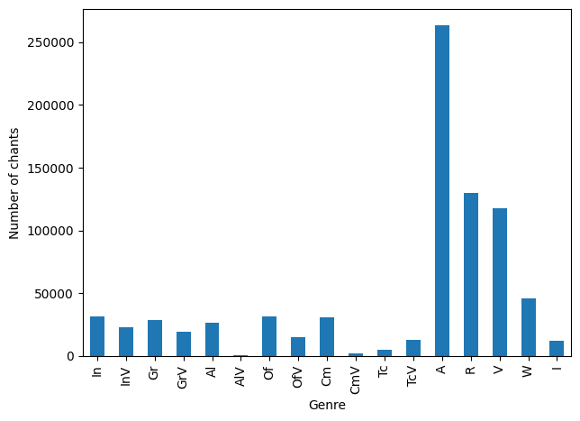
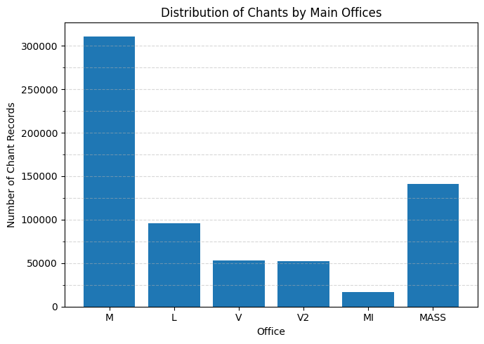
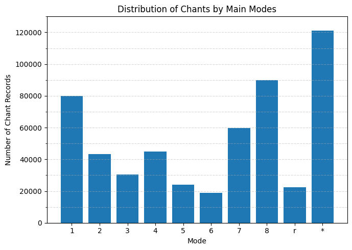
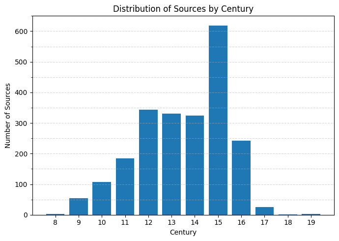
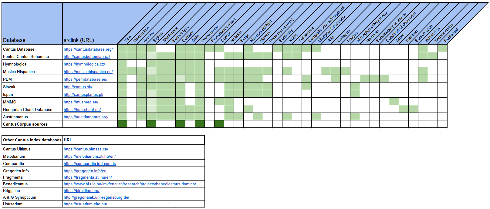

CantusCorpus 1.0
========================

CantusCorpus 1.0 is a large dataset of Gregorian chant data intended for computational research.
The dataset consists of all chants that are searchable through Cantus Index, combining data from 10 individual
chant databases. Primarily these are catalogue records: which chants appear in which manuscripts.
What allows us to identify multiple instances of a chant across different manuscripts
is the **CantusID** mechanism, established from the long history of the Cantus Database.
Thus, CantusCorpus 1.0 has two components: **chants**, and **sources** (manuscripts).

CantusCorpus lies inherently downstream of the Cantus Database and the whole Cantus Index network
of compatbile chant databases: we do not revisit anyone's editorial decisions. However, the value
of this dataset is that the sum of all the editorial decisions made over the databases' decades of existence
are being made available as a dataset for computational research, together with the PyCantus library
that makes handling this dataset (almost) easy.

## Licence

The CantusCorpus is released under a CC BY-NC-SA 4.0 license, just like the Cantus Index itself.

## Dataset contents

Summary | |
----- | -----: |
Cantus Index was scraped on | 20th May 2025
CantusCorpus 1.0 was completed on | 19th June 2025
Number of chant records | 888010
Number of chant records with some melody transcribed | 60588
Number of chant records with melody of more than 20 notes | 44625
Number of sources | 2278
Number of sources with provenance information | 1606
Number of sources with century information | 2240
Number of sources with cursus information | 345

  

We show the distribution of main chant genres, offices, and modes, and how sources are distributed across centuries.

*Main genres distribution*

*Main offices distribution*

*Main modes distribution*

*Century distribution*

 

## Data fields

The dataset is distributed as a pair of CSV files: one for chants, one for sources.
Here we describe the data format of these CSVs.

### Chants

Field | Description
----- | ------
**chantlink** (*) | URL link directly to the chant entry in the external database (e.g., `https://cantusbohemiae.cz/chant/38731`).
**incipit** (*) | The opening words or phrase of the chant (e.g., `Virginis ob meritum manet hoc memorabile`).
**cantus_id** (*) | The unique Cantus ID associated with the chant (e.g., `"601551a"`).
**mode** | Mode of the chant (e.g., `1`).
**siglum** (*) | Abbreviation for the source manuscript or collection (e.g., `CZ-Pu (Praha) VI G 3a`), RISM possibly.
**position** | Liturgical position of the chant in the office (e.g., `01`).
**folio** (*) | Folio information for the chant (e.g., `207v`).
**sequence** | The order of the chant on the folio (e.g., `1`).
**feast** | Feast or liturgical occasion associated with the chant (e.g., `Catharinae`).
**feast_code** | Additional identifier unifying feasts with multiple spellings. The values themselves are meaningful in Cantus Index.
**genre** | Genre of the chant, such as antiphon (`A`), responsory (`R`), hymn (`H`), etc. Full list in Cantus Index.
**office** | The office in which the chant is used, such as Matins (`M`) or Lauds (`L`) or Vespers (`V`). This is less controled than genre; we primarily use the vocabulary of Cantus Database, but leave non-standard office names according to the conventions of individual databases; there is ongoing policy discussion for office codes in Cantus Index.
**srclink** (*) | URL link to the source in the external database (e.g., `https://cantusbohemiae.cz/source/9147`).
**melody_id** | The unique Melody ID associated with the chant (e.g., `"001216m1"`).
**full_text** | Full text of the chant (e.g., `Virginis ob meritum manet hoc memorabile signum`).
**volpiano** | Melody encoded in Volpiano (e.g., `1---dH---h7--h--ghgfed--gH---h--h---`).
**db** (*) | Code for the database providing the data, used for identification within CI (e.g., `"FCB"`).
**image** | URL link to an image of the manuscript page (e.g., `https://manuscripta.at/diglit/AT5000-589/0241`).

### Sources

Field | Description
----- | ------
**title** | Name of manuscript
**siglum** (*) | Abbreviation for the source manuscript or collection (e.g., `CZ-Pu (Praha) VI G 3a`), RISM possibly.
**century** | Textual value identifying the century of the source. (e.g., `14th century`).
**provenance** | Place of origin or place of use of the source.
**srclink** (*) | URL link to the source in the external database (e.g., `https://cantusbohemiae.cz/source/9147`).
**cursus** | Secular (Cathedral, Roman) or Monastic cursus of the source.
**num_century** | Number only representation of century value.

**Fields marked with (*) are required** and thus should be present in all records of CantusCorpus 1.0.

We prioritised collecting these specific fields for source metadata not only because we see how they can be useful for computational chant research, but also because they have the broadest support among source databases. Here we present an overview of what is supported in which database.

*Overview of support for different source metadata among CI databases*

Databases that are in the list of *Other Cantus Index databases* are not analysed because they are not (at least currently) included in our scraping process: none of their entries are accessible via the Cantus Index JSON API, which we take as the authoritative source of data.

 

## Obtaining and cleaning the data

The Cantus network of databases is never done: more chants are indexed every week.
(The growth between 2024 and 2025 was more than 50,000 chant records.) Therefore, the value of this dataset
will diminish over time as a representant of digital chant scholarship materials. For this purpose, we release
not only the dataset but also the tools to re-build it

The database network was scraped using its JSON API genre-by-genre and converted to easy-to-use CSV files. Source metadata was scraped from front-ends of individual databases and again joined into a CSV file. 

A description of scraping procedures with code can be found in the `scraping/` directory provided together with CantusCorpus 1.0. Because a refreshing mechanism has to be called to get up-to-date information for each CantusID, which triggers a Cantus Index query across all its component databases, the scraping process takes a relatively long time, and therefore needed to be parallelized. We worked with a SLURM cluster for this; for scraping on other parallel computing infrastructure, the scripts that distribute Cantus IDs to jobs and then combine them back will have to be adapted accordingly.

After scraping, we performed the following data cleaning steps:
- Join all chant files by genre into one file
- Discard duplicates in chantlinks
- Genre standardisation based on the genre list in CI from which those records were from (issues only around Tp...)
- Discard data (from chants and sources), where for sources we cannot collect additional info
- Add a numerical century in sources
- Inspect duplicate sources: discard and unify duplicates
- Discard newlines from field values (esp. full text for strophic chants)

Details on that can be found in the `get_dataset_from_scrapes.ipynb`.  

