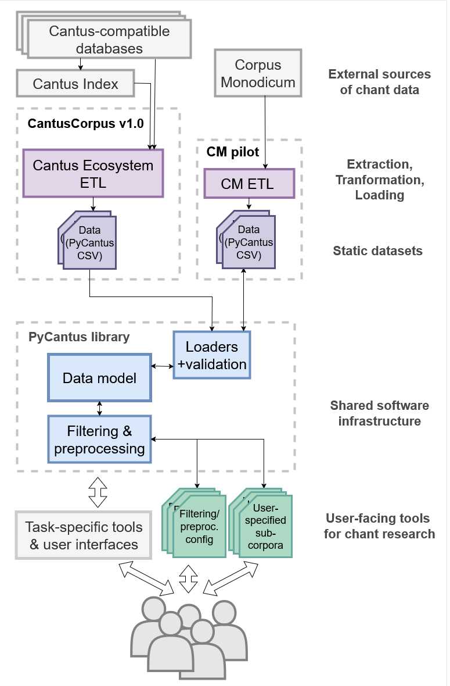
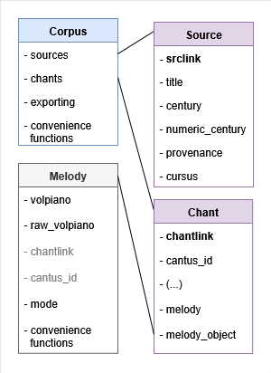
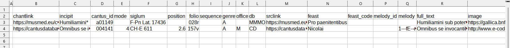

# PyCantus Development Documentation

PyCantus is a lightweight Python library for loading 
and manipulating Gregorian chant data, e.g. the CantusCorpus v1.0 dataset.
The “division of labour” between the library and dataset is shown in the schema bellow. 
Most importantly, PyCantus implements a data model for CantusCorpus v1.0.
However, the library is an independent component, so the data model can be reused for datasets assembled
from other sources of chant data (e.g. Corpus Monodicum database).
  
  

  

PyCantus functionality is introduced by a tutorials which guides the user through the steps required to prepare a sub-corpus for experiments. The library source code and documentation are available at [https://github.com/dact-chant/PyCantus](https://github.com/dact-chant/PyCantus).

The design of the library is influenced by the idea of two different kinds of users: a group of programmers who are getting into Gregorian chant, and then (hopefully) a group of chant experts who are getting into its computer processing.  
Therefore in design choices of some features one can observe an unusual inflexibility. That is motivated by attempts to do not let people shoot themselves into foot too easily. Also the data are kind of "alive" and so part of the responsibilities that would usually lie on such library is in this case "in the datasets" (this holds especially around validation).


## Content
- [Data Model](#data-model)
  - [Corpus](#corpus)  
  - [Chant](#chant)  
  - [Source](#source)  
  - [Melody](#melody)  

- [Loaders + validation](#loaders--validation)
  - [Examples of CSV files to be loaded](#examples-of-csv-files-to-be-loaded)

- [Filtering & preprocessing](#filtering--preprocessing) 
    - [History of operations](#history-of-operations)  


## Data Model
The core of PyCantus is the data model the `Chant` and `Source` classes representing the corresponding items of the dataset,
a `Corpus` class to aggregate them, and a `Melody` class to support abstracting away from specific melody encodings in the future. (We are aware of the chant21 library, but we opted not to make music21 a core dependency of PyCantus.)

Classes related to data model has its implementations in `models` folder.

For all four data classes we can divide their data attributes into to groups:
- Data related (data fields based on CantusCorpus v1.0 structure)
- Functional (quality-of-life fields such as locking or more flexible melody handling)

Besides that, some of the data model classes has convenience methods described bellow.


Here is a schema of the data model:



Attributes in bold are primary keys (identifiers) - in case of Corpus it can be a pair.  
Gray dashed lines signal foreign key relation.  
The attribute *locked* is strictly functional attribute, that is initially set based on the value of `is_editable` attribute of `Corpus` class.

More details about data classes follow.


### Corpus

`Corpus` class represents a collection of chants and sources.
It provides methods for loading, filtering, and exporting data related to the chants and sources.

The only way to initialize `Corpus` is via load from CSV files, it is not possible from chants and sources lists. That is due to the "good replicability practice" we wanted to emphasize. Good experiment 

#### Attributes:
- `chants_filepath (str)`: path to file with chants
- `sources_filepath (str)`: path to file with sources
- `chants_fallback_url (str)`: URL for chants file download, is used when loading from filepath fails
- `sources_fallback_url (str)`: URL for sources file download, is used when loading from filepath fails
- `other_download_parameters (dict)`: [not used yet]
- `is_editable (bool)`: indicates whether objects in Corpus should be locked
- `check_missing_sources (bool)`: indicates whether load should an raise exception if some chant refers to source that is not in sources
- `create_missing_sources (bool)`: indicates whether load should create Source entries for sources referred to in some of the chants and not being present in provided sources
- `_chants (list)`: list of `Chant`s in the corpus
- `_sources (list)`: list of `Source`s in the corpus 
- `operations_history (list)`: list of operations applied on the corpus (from predefined list - see methods with `@log_operation` decorator)


#### Locked attribute
The 'locking logic' is quite simple. We don't want people to shoot themselves in the foot, so we tried to force them to make changes in the state of their data (in `Corpus`) explicit. Besides that, it is also part of the 'good replicability' strategy we want to emphasize.

In the initialization of `Corpus` object, argument `is_editable` is passed (with default value set to `False`). 

Then getters and setters of `Corpus` were overwritten so the 'I am a locked corpus' logic is controlled. 

Value of the `is_editable` attribute is propagated into all Chants, Sources and Melodies in the Corpus with `Corpus._lock_chants()`, `Corpus._lock_sources()` and in `Chant.create_melody()`, where attribute `locked` is set to `True` if 'is not editable corpus'. In these objects it "operates" in the overwritten method `__settatr__` and limits access to others then `locked` attributes based on the value of `locked`. You can set the value of the `locked` attribute freely -- because that makes the intervention in the data state explicit, but not impossible.

#### Methods
For easier work with the data few methods were implemented directly on `Corpus`.

- `export_csv(chants_path, sources_path)`
- `drop_duplicate_chants()`
- `drop_duplicate_sources()`
- `keep_melodic_chants()`
- `drop_empty_sources()`
- `drop_small_sources_data(min_chants)`
- `drop_incomplete_chants()`
- `apply_filter()`
- `get_operations_history_string()`

Their description can be found in reference documentation.

#### Property Methods
Some of the methods of `Corpus` are decorated with `@property` so that they can be called as property (attribute) of the object, because that is the intuitive comprehension we have about them.  

- `to_csv_row` - "returns" string value, method constructs the correct string representing the Chant record as a row of CSV file (used e.g. in `Corpus.export_to_csv` method)
- `sources` - getter of `_sources`
- `chants` - getter of `_chants`
- `melody_objects` - returns list of `Melody` objects from chants
- `csv_chants_header` - standardized CSV header string for chants
- `csv_sources_header` - standardized CSV header string for sources


-----
### Chant

`Chant` class represents a single chant entry from some database.
It provides methods for creating, modifying, and exporting chant data in a standardized format.


#### Data related attributes:
- `siglum (str)`: \* Abbreviation for the source manuscript or collection (e.g., "A-ABC Fragm. 1"). Use RISM whenever possible.  
- `srclink (str)`: \* URL link to the source in the external database (e.g., "https://yourdatabase.org/source/123").  
- `chantlink (str)`: \* URL link directly to the chant entry in the external database (e.g., "https://yourdatabase.org/chant/45678").  
- `folio (str)`: \* Folio information for the chant (e.g., "001v").  
- `sequence (str)`: The order of the chant on the folio (e.g., "1").  
- `incipit (str)`: \* The opening words or phrase of the chant (e.g., "Non sufficiens sibi semel aspexisse vis ").  
- `feast (str)`: Feast or liturgical occasion associated with the chant (e.g., "Nativitas Mariae").
- `genre (str)`: Genre of the chant, such as antiphon (A), responsory (R), hymn (H), etc. (e.g., "V").
- `office (str)`: The office in which the chant is used, such as Matins (M) or Lauds (L) (e.g., "M").
- `position (str)`: Liturgical position of the chant in the office (e.g., "01").
- `cantus_id (str)`: The unique Cantus ID associated with the chant (e.g., "007129a").
- `melody_id (str)`: The unique Melody ID associated with the chant (e.g., "001216m1").
- `image (str)`: URL link to an image of the manuscript page, if available (e.g., "https://yourdatabase.org/image/12345").
- `mode (str)`: Mode of the chant, if available (e.g., "1").
- `full_text (str)`: Full text of the chant (e.g., "Non sufficiens sibi semel aspexisse vis amoris multiplicavit in ea intentionem inquisitionis").
- `melody (str)`: Melody encoded in volpiano, if available (e.g., "1---dH---h7--h--ghgfed--gH---h--h---").
- `century (str)`: Number identifying the century of the source. If multiple centuries apply, the lowest number should be used. (e.g., "12").
- `db (str)`: \* Code for the database providing the data, used for identification within CI (e.g., "DBcode").
------
Non Cantus Index fields - not in export:
- `rite (str)`: Value of liturgical rite of the chant 
- `_has_melody (bool)`: True if the chant has a melody, False otherwise.
- `melody_object (Melody)`: If the chant has a melody, this should be an instance of the Melody class representing the chant's melody once created.

The \* signals that such attribute always has some value (is not equal to `None` or empty string `''`).

Here we would like to point out the inconsistency in filling the data fields among source databases.

#### Functional attributes:
- `locked (bool)`: Indicates whether the object is locked for editing. If True, no attributes can be modified.

For more info about 'locking logic' refer to description of this in the [Corpus section](#corpus).


#### Property methods
Some of the methods of `Chant` are decorated with `@property` so that they can be called as property (attribute) of the object, because that is the intuitive comprehension we have about them.  
These are:
- `is_complete_chant` - bool value (checks presence of full text and long enough melody)
- `to_csv_row` - string value, method constructs the correct string representing the Chant record as a row of CSV file (used e.g. in `Corpus.export_to_csv` method)

So we can have a piece of code:
```
if chant.is_complete_chant:
    print(chant.to_csv_row)
```

#### Static methods
Method decorated with `@static` here is a `Chant.header()`. It returns standardized CSV header string for chants. By standardized we mean compatible with what `Chant.to_csv_row` returns.

#### Methods
`Chant` has only one standard method which is `create_melody()`. It creates a object of `Melody` class for the chant if it has some melody. Expects volpiano to be provided.

-----
### Source
`Source` class represents a single source entry from some database.
It provides methods for creating, modifying, and exporting source data in a standardized format.


#### Data related attributes:
- `title (str)`: \* Name of the source (can be same as siglum)
- `srclink (str)`: \* URL link to the source in the external database (e.g., "https://yourdatabase.org/source/123").
- `siglum (str)`: \* Abbreviation for the source manuscript or collection (e.g., "A-ABC Fragm. 1"). Use RISM whenever possible.
- `numeric_century (int)`: Integer representing the value of century field.
- `century (str)`: Century of source origin.
- `provenance (str)`: Name of the place of source origin.
- `cursus (str)`: Secular (Cathedral, Roman) or Monastic cursus of the source. 

The \* signals that such attribute always has some value (is not equal to `None` or empty string `''`).

Here we would like to point out the inconsistency in filling the data fields among source databases, about sources this holds even more then about chants.


#### Functional attributes:
- `locked (bool)`: Indicates whether the object is locked for editing. If True, no attributes can be modified. (functional attribute)

For more info about 'locking logic' refer to description of this in the [Corpus section](#corpus).


#### Property methods
Some of the methods of `Source` are decorated with `@property` so that they can be called as property (attribute) of the object, because that is the intuitive comprehension we have about them.  
These are:
- `is_complete_chant` - bool value (checks presence of full text and long enough melody)
- `to_csv_row` - string value, method constructs the correct string representing the Chant record as a row of CSV file (used e.g. in `Corpus.export_to_csv` method)

#### Static methods
Method decorated with `@static` here is a `Source.header()`. It returns standardized CSV header string for sources. By standardized we mean compatible with what `Source.to_csv_row` returns.

----

### Melody
`Melody` class represents a single chant melody.

It is linked to a specific chant record via `chantlink` as an unique chant record identifier and also by being stored in the corresponding  chant in `Chant.melody_object`.  

Right now, it is designed in a volpiano-centric way, meaning it holds only the volpiano representation of the chant melody, if present. But it can be extended to hold other representations in the future (via new optional parameters).

We take the `volpiano.utils` as already prepared methods (functions) for working with volpiano and just wrapped them into `Melody` class methods. 
For more detailed documentation of the methods, see the `volpiano/utils.py` module.


#### Data related attributes
`cantus_id`, `chantlink` and `raw_volpiano` are partly equal to those that were used in initialization of related `Chant` record (`Melody.raw_volpiano` == `Chant.melody`).  
Having these here should just make things more convenient for working with melodies (e.g. when we want to take only list of melodies from corpus while not being interested in source information in such situation, while still being able to get it from `chantlink` when needed or when comparing what melody modifying operation did to the volpiano string).

- `volpiano (str)`: The melody encoded in volpiano notation (this is modified by melody related operations)
- `chantlink (str)`: URL link directly to the chant entry in the external database.
- `cantus_id (str)`: The Cantus ID associated with the chant.
- `raw_volpiano (str)`: The original volpiano string before any processing.
- `mode (str)`: Mode of the melody (e.g., "1").

        

#### Functional attributes
- `locked (bool)`: Indicates if the object is locked for editing.

For more info about 'locking logic' refer to description of this in the [Corpus section](#corpus).

#### Methods
These are mostly wrappers for methods from `volpiano.utils` being applied to `Melody.volpiano`.

- `clean_volpiano()`
- `normlize_volpiano()`
- `expand_accidentals()`
- `normalize_liquescents()`
- `discard_differentia()`
- `get_range()`

Their description can be found in reference documentation of `Melody` and `volpiano.utils`.


## Loaders + validation
The `data.load_dataset(...)` function from the `data` module (implemented in `data.py`) is used to load the dataset into the Corpus object and collect all needed parameters as well as .


Data are loaded into the `Corpus` class via a `CsvLoader` object (implemented in `dataloaders/loader.py`).
The loader also handles the possible download of missing CSV files from provided fallback URL addresses and 
validation. 

Given the lack of controlled vocabularies, currently it cannot do more than check whether mandatory fields and their values are present and also optionally check unavailable source records (arguments `check_missing_sources` and `create_missing_sources`).

As was just written, the only validation we implemented into PyCantus is checking if mandatory fields have some value present - but not what value it is... 
  
As Cantus Index is growing quite quickly it can hardly be updated enough to e.g. check validity Cantus IDs. Also making these controlled  vocabularies for fields is not our decision to make in general. (To have an idea how difficult this can be refer to Harmonization issues report in CantusCorpus v1.0 and/or tutorial 02_intro_to_chant_data.ipynb.)
  
Another reason for not making validation strict part of the procedure of loading data into PyCantus is an accessibility of the library for people outside Cantus ecosystem. For data 'not from Cantus Index world' one can assign arbitrary values into non-relevant fields (e.g. Cantus ID) and still use the library for their work.

While loading the data `CsvLoader` creates `Source.numeric_century` values from given `century` value (see `get_numerical_century(str)` function in `dataloaders/loader.py`).

Overall with preparing your own CSV files take care of formatting the file as a correct CSV. The Python library PyCantus is using for this is `pandas`. It can save some troubles but is not a magician, so especially `\n` characters inside lines can cause troubles with loading your data correctly.


### Examples of CSV files to be loaded 
Here we present examples of CSV files and how PyCantus would behave when loading them.

#### 1. Correct example

`chants.csv`
```
chantlink,incipit,cantus_id,mode,siglum,position,folio,sequence,feast,feast_code,genre,office,srclink,melody_id,full_text,melody,db,image  
https://musmed.eu/chant/118468,Humiliamini*,a01149,,F-Pn Lat. 17436,,028r,,Pro paenitentibus,,A,,http://musmed.eu/source/13502,,Humiliamini sub potenti manu dei ut vos exaltet in tempore visitationis omnem sollicitudinem vestram proicientes in eum quoniam ipsi cura est de nobis,,MMMO,https://gallica.bnf.fr/ark:/12148/btv1b8426787t/f61.item.zoom
https://cantusdatabase.org/chant/231265,Omnibus se invocantibus benignus adest,004141,4,CH-E 611,2.6,157v,,Nicolai,14120600,A,M,https://cantusdatabase.org/source/123606,,Omnibus se invocantibus benignus adest sanctus Nicolaus gloria tibi trinitas deus,1---fE--de--fdc---dc---d--ef--g--de--e---dh--hG--g---hk--hg-gfe---e--g---gh--hgfe--de--e77---efg--fe--d---g--f---gh--gfe--dE---e--e---4---h--g--h--k--g--e---3,CD,http://www.e-codices.unifr.ch/en/sbe/0611/157v/small

```
And here is how this looks opened in spreadsheet editor:


`sources.csv`
```
title,siglum,century,provenance,srclink,cursus
F-Pn : Lat. 17436,F-Pn Lat. 17436,9th century,Abbaye Saint-Corneille de Compiègne,https://musmed.eu/source/13502,Romanum
"Einsiedeln, Stiftsbibliothek, 611",CH-E 611,14th century,Einsiedeln,https://cantusdatabase.org/source/123606,Monastic
```
This pair of files will be loaded with PyCantus without any problems.  
Though some columns are partially empty (e.g. office) and some are empty completely (e.g. feast_code) as these are not mandatory, everything is fine.

#### 2. Missing sources

`chants.csv`
```
chantlink,incipit,cantus_id,mode,siglum,position,folio,sequence,feast,feast_code,genre,office,srclink,melody_id,full_text,melody,db,image  
https://musmed.eu/chant/118468,Humiliamini*,a01149,,F-Pn Lat. 17436,,028r,,Pro paenitentibus,,A,,http://musmed.eu/source/13502,,Humiliamini sub potenti manu dei ut vos exaltet in tempore visitationis omnem sollicitudinem vestram proicientes in eum quoniam ipsi cura est de nobis,,MMMO,https://gallica.bnf.fr/ark:/12148/btv1b8426787t/f61.item.zoom
https://cantusdatabase.org/chant/231265,Omnibus se invocantibus benignus adest,004141,4,CH-E 611,2.6,157v,,Nicolai,14120600,A,M,https://cantusdatabase.org/source/123606,,Omnibus se invocantibus benignus adest sanctus Nicolaus gloria tibi trinitas deus,1---fE--de--fdc---dc---d--ef--g--de--e---dh--hG--g---hk--hg-gfe---e--g---gh--hgfe--de--e77---efg--fe--d---g--f---gh--gfe--dE---e--e---4---h--g--h--k--g--e---3,CD,http://www.e-codices.unifr.ch/en/sbe/0611/157v/small
```
`sources.csv`
```
title,siglum,century,provenance,srclink,cursus
F-Pn : Lat. 17436,F-Pn Lat. 17436,9th century,Abbaye Saint-Corneille de Compiègne,https://musmed.eu/source/13502,Romanum
```
With this pair of files reaction of PyCantus depends on parameters of initialization of `Corpus`:  

If `check_missing_sources` is set to `True`:  
We will recieve Error saying:
```
ValueError: 
Source 'https://cantusdatabase.org/source/123606 : CH-E 611' from chants does not have record in provided sources!
```

If `check_missing_sources` is set to `False` and `create_missing_sources`is set to `True`:  
PyCantus would not return Error and also will inform us, how many sources was created - that means how many  `Source` entry was constructed from `siglum` and `srclink` columns of `chants.csv` (where `title` is taken equal to `siglum`).


PyCantus load works even without `sources.csv` file being passed.


#### 3. Minimal example
Here is an example demonstrating how minimal validation is implemented in PyCantus (and so how minimal demands there are).

`chants.csv`
```
chantlink,incipit,folio,cantus_id,siglum,srclink,db
hello.com,Carpe Diem,42,754r,Siglum,https://cantus.org/911,CSK
```
`sources.csv`
```
title,siglum,srclink
Pride and Prejudice,MaledivesLib-22,www.howtouseinternet.io
```
With this file PyCantus will load everything happily.  
No checking of existence of `chantlink`, `sourcelink` as well as `Cantus ID` is present in the library. Also these 7 and 3 are the minimal mandatory columns that has to be present in the files and filled for all lines for load to work in PyCantus.

Totally minimal working example would be fine even without `sources.csv` file (possibly with `check_missing_sources` parameter of `Corupus` init set to `True` but not necessarily).


#### 4. Problems
##### 1. Missing mandatory columns  
For example:
```
Exception: 
Error loading CSV sources.csv file: Missing mandatory fields in CSV: siglum
```

##### 2. Missing value in mandatory column
For example:
```
Exception: 
Error loading CSV chants.csv file: Missing mandatory field 'srclink' in chants in row 15
```

## Filtering & preprocessing

Preprocessing  besides filtering is implemented in functions of `Corpus` (such as `drop_empty_sources()` and similar ones).

For filtering class `Filter` is introduced (implemented in `filtration/filter`). It stores values for each data field of `Chant` and `Source` that has to be included in or excluded from the resulting sub-corpus.

Filtration is supposed to be called on `Corpus` with `apply_filter(Filter)` method, internally method `apply(chants, sources)` of the passed `Filter` is called. This methods iterates over passed `Chants` and `Sources` and keeps those meeting the filtration criteria (include and exclude values definitions).

The setup can be stored in YAML file (simple string representation) with `export_yaml` and then loaded into `Filter` with `import_yaml(path)` or `import_string(yaml_string)` methods on `Filter` .


### History of operations

To support replicability we add sort of logging for selected operations so order of applied methods can be stored for later. For that there is `HistoryEntry` class, objects of whom are stored in a list that is a attribute of the `Corpus` class.

The process is secured using a decorator `@log_operation`, that has its implementation in `history/utils.py`.

Methods that are saved into `self.operations_history` of `Corpus`:
- `drop_duplicate_chants()`
- `drop_duplicate_sources()`
- `keep_melodic_chants()`
- `drop_empty_sources()`
- `drop_small_sources_data(int)`
- `apply_filter(Filter)`
- `drop_incomplete_chants()`
- `drop_incomplete_chants()`
- and also if `Corpus.create_missing_sources` is `True`, then that is noted to the history in `Corpus` initialization

Whole history can be represented as one human-readable string via calling `get_operations_history_string()` method on `Corpus`. Besides the operations history it also returns paths to csv files used for intialization of the `Corpus` to emphasize the replicability.

