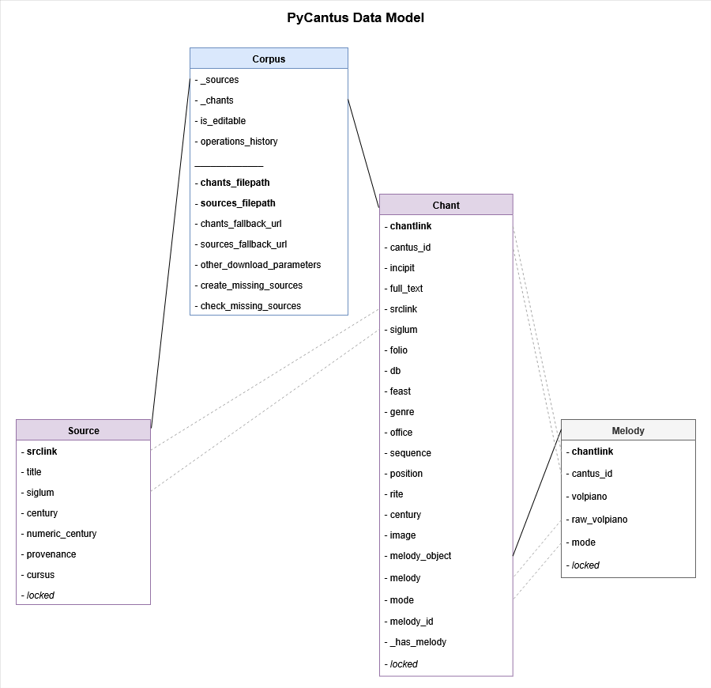

# PyCantus Development Documentation

PyCantus is a lightweight Python library for loading 
and manipulating Gregorian chant data, e.g. the CantusCorpus v1.0 dataset.
The “division of labour” between the library and dataset is shown in the schema bellow. 
Most importantly, PyCantus implements a data model for CantusCorpus v1.0.
However, the library is an independent component, so the data model can be re-used for datasets assembled
from other sources of chant data (e.g. Corpus Monodicum database).
  
  

  
PyCantus functionality is introduced by a tutorial which guides the user through the steps required to prepare a sub-corpus for experiments. The library source code and documentation are available at [https://github.com/dact-chant/PyCantus](https://github.com/dact-chant/PyCantus).

## Data Model
The core of PyCantus is the data model the `Chant` and `Source` classes representing the corresponding items of the dataset,
a `Corpus` class to aggregate them, and a `Melody` class to support abstracting away from specific melody encodings in the future. (We are aware of the chant21 library, but we opted not to make music21 a core dependency of PyCantus.)

Classes related to data model has its implementations in `models` folder.

For all four data classes we can divide their data attributes into to groups:
- data related (data fields based on CantusCorpus v1.0 structure)
- functional (quality-of-life fields such as locking or more flexible melody handling)

Besides that, some of the data model classes has convenience methods described bellow.

Here is a simplified schema of the data model:

More detailed lists of attributes follows.  

### Corpus

`Corpus` class represents a collection of chants and sources.
It provides methods for loading, filtering, and exporting data related to the chants and sources.

The only way to initialize `Corpus` is via load from CSV files, it is not possible from chants and sources lists. That is due to "good replicability practice" we wanted to emphasize.

Attributes:

#### Locked attribute
The 'locking logic' is quite simple. We don't want people to shoot themselves in the foot, so we tried to make changes in the state of data (in `Corpus`) explicit.

### Chant

`Chant` class represents a single chant entry from some database.
It provides methods for creating, modifying, and exporting chant data in a standardized format.

Data related attributes:
- siglum (str): \* Abbreviation for the source manuscript or collection (e.g., "A-ABC Fragm. 1"). Use RISM whenever possible.  
- srclink (str): \* URL link to the source in the external database (e.g., "https://yourdatabase.org/source/123").  
- chantlink (str): \* URL link directly to the chant entry in the external database (e.g., "https://yourdatabase.org/chant/45678").  
- folio (str): \* Folio information for the chant (e.g., "001v").  
- sequence (str): The order of the chant on the folio (e.g., "1").  
- incipit (str): \* The opening words or phrase of the chant (e.g., "Non sufficiens sibi semel aspexisse vis ").  
- feast (str): Feast or liturgical occasion associated with the chant (e.g., "Nativitas Mariae").
- genre (str): Genre of the chant, such as antiphon (A), responsory (R), hymn (H), etc. (e.g., "V").
- office (str): The office in which the chant is used, such as Matins (M) or Lauds (L) (e.g., "M").
- position (str): Liturgical position of the chant in the office (e.g., "01").
- cantus_id (str): The unique Cantus ID associated with the chant (e.g., "007129a").
- melody_id (str): The unique Melody ID associated with the chant (e.g., "001216m1").
- image (str): URL link to an image of the manuscript page, if available (e.g., "https://yourdatabase.org/image/12345").
- mode (str): Mode of the chant, if available (e.g., "1").
- full_text (str): Full text of the chant (e.g., "Non sufficiens sibi semel aspexisse vis amoris multiplicavit in ea intentionem inquisitionis").
- melody (str): Melody encoded in volpiano, if available (e.g., "1---dH---h7--h--ghgfed--gH---h--h---").
- century (str): Number identifying the century of the source. If multiple centuries apply, the lowest number should be used. (e.g., "12").
- db (str): \* Code for the database providing the data, used for identification within CI (e.g., "DBcode").

- rite (str): (not yet in CI, but possibly to be (so we want to be ready), not in export)

Functional attributes:
- locked (bool): Indicates whether the object is locked for editing. If True, no attributes can be modified. (functional attribute)
- _has_melody (bool): True if the chant has a melody, False otherwise. (functional attribute)
- melody_object (Melody): If the chant has a melody, this should be an instance of the Melody class representing the chant's melody once created.
    

### Source
`Source` class represents a single source entry from some database.
It provides methods for creating, modifying, and exporting source data in a standardized format.

Data related attributes:
- title (str): \* Name of the source (can be same as siglum)
- srclink (str): \* URL link to the source in the external database (e.g., "https://yourdatabase.org/source/123").
- siglum (str): \* Abbreviation for the source manuscript or collection (e.g., "A-ABC Fragm. 1"). Use RISM whenever possible.
- numeric_century (int): Integer representing the value of century field.
- century (str): Century of source origin.
- provenance (str): Name of the place of source origin.
- cursus (str): Secular (Cathedral, Roman) or Monastic cursus of the source. 

Functional attributes:
- locked (bool): Indicates whether the object is locked for editing. If True, no attributes can be modified. (functional attribute)

### Melody

## Loaders + validation
The `data.load_dataset(...)` function from the `data` module (implemented in `data.py`) is used to load the dataset into the Corpus object and collect all needed parameters as well as .

Data are loaded into the `Corpus` class via a `CsvLoader` object (implemented in `dataloaders/loader.py`).
The loader also handles the possible download of missing CSV files from provided fallback URL addresses and 
validation. Given the lack of controlled vocabularies, currently it cannot do more than check whether mandatory fields and their values are present and also optionally check unavailable source records (arguments `check_missing_sources` and `create_missing_sources`).

While loading the data `CsvLoader` creates `Source.numeric_century` values from given `century` value (see `get_numerical_century(str)` function in `dataloaders/loader.py`).

## Filtering & preprocessing

Preprocessing  besides filtering is implemented in functions of `Corpus` (such as `drop_empty_sources()` and similar ones).

For filtering class `Filter` is introduced (implemented in `filtration/filter`). It stores values for each data field of `Chant` and `Source` that has to be included in or excluded from the resulting sub-corpus.

Filtration is supposed to be called on `Corpus` with `apply_filter(Filter)` method, internally method `apply(chants, sources)` of the passed `Filter` is called. This methods iterates over passed `Chants` and `Sources` and keeps those meeting the filtration criteria (include and exclude values definitions).

The setup can be stored in YAML file (simple string representation) with `export_yaml` and then loaded into `Filter` with `import_yaml(path)` or `import_string(yaml_string)` methods on `Filter` .

### History of operations

To support replicability we add sort of logging for selected operations so order of applied methods can be stored for later. For that there is `HistoryEntry` class, objects of whom are stored in a list that is a attribute of the `Corpus` class.

The process is secured using a decorator `@log_operation`, that has its implementation in `history/utils.py`.

Methods that are saved into `self.operations_history` of `Corpus`:
- `drop_duplicate_chants()`
- `drop_duplicate_sources()`
- `keep_melodic_chants()`
- `drop_empty_sources()`
- `drop_small_sources_data(int)`
- `apply_filter(Filter)`

Whole history can be represented as one human-readable string via calling `get_operations_history_string()` method on `Corpus`.

