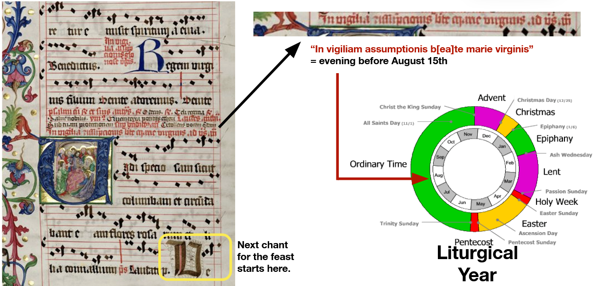
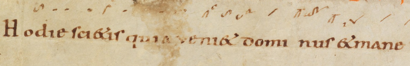
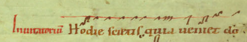
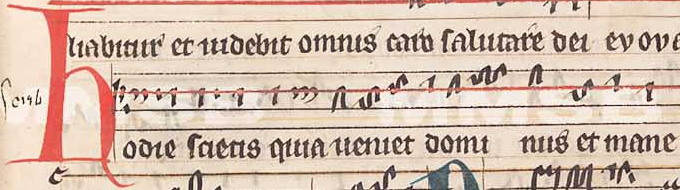
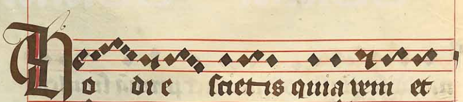
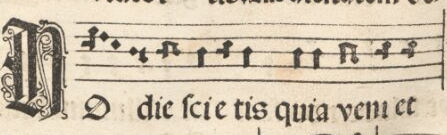
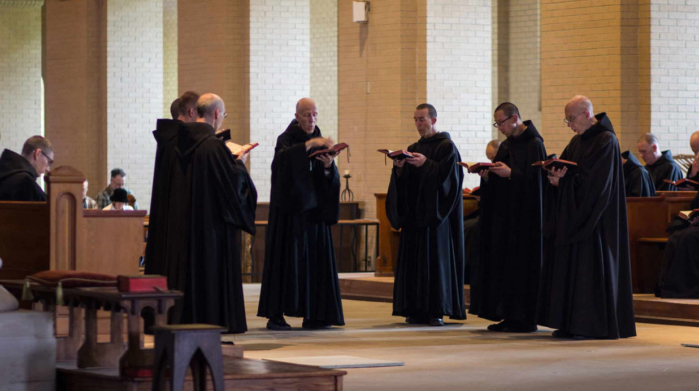
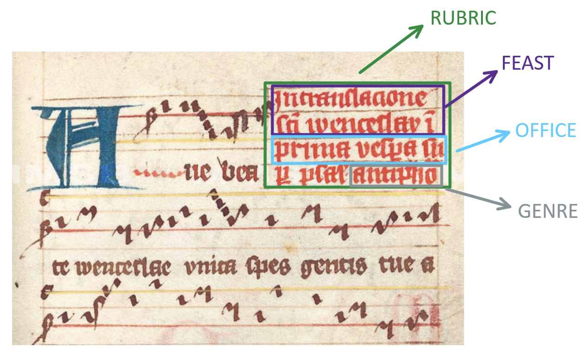

# Intro to Gregorian Chant Data

Gregorian chant is the universal liturgical vocal monody (music written for only a single voice) of the Latin church (today specifically the Roman Catholic church), an essential part of Western music history, and a dominant musical tradition in Latin Europe, as well as an expression of its religious and political unity. It is a musical tradition that is highly regulated by the institutions of the Roman Church: each day of the year has an assigned set of chants to be sung at specific points of the liturgies of that day. The Roman rite (and its variants in the Latin church) defines positions in liturgy for more than 3,000 such units of chant repertoire in the liturgical calendar.

The moniker **“Gregorian”** comes from the legend of Pope Gregory I, who supposedly dictated Gregorian repertoire as sung to him by a dove of the Holy Spirit. Current historical understanding is that Gregory I had little to do with this music: rather, its origins and rise have to do with the establishment of the Frankish empire under Pepin III and especially Charlemagne, in the late 8th and early 9th century. However, the legend of the divine origin of Gregorian chant, including its melodies, obligated practitioners to perform chant faithfully to this implied “original”. This differentiates Gregorian chant from many other liturgical monodies: e.g., Greek Catholic chant allows singers to choose melodic patterns that match different pronunciations of its language, Church Slavonic, depending on the native language of the singers.  
  
A significant effort was expended to conserve chant: both in rules for the institutional practice of the *schola cantorum* model, where a selected member of the given community had the responsibility to teach new members the repertoire and correct deviations and in the production of liturgical books with notated melodies, at significant expense. Conserving Gregorian melodies in fact even motivated development of a major feature of modern music notation: the staff, an 11th-century innovation of Guido of Arezzo, which allowed notating pitches exactly and thus enabled learning the melodies without a teacher present. The staff was adopted very quickly and by the end of the 11th century, practically no new manuscripts with earlier adiastematic notation were being produced.
  

Chant *Hodie scietis* from CH-SGs 390, f. 041, end of 10th century.  

Chant *Hodie scietis* from  Cz-Pu XIV B 13, f. 021r, beginning of 14th century.

Chant *Hodie scietis* from A-KN 1010, f. 019r, 12th century.
  

Chant *Hodie scietis* from Cz-Pn XII A 24, f. 027v, beginning of 15th century.
  

Chant *Hodie scietis* from MA Impr. 1537, f. 025r, 16th century.

While after the 2nd Vatican Council in the 1960s, the role of chant in liturgy diminished (in practice, even though the council's documents still affirm Gregorian chant as the primary musical tradition of the Church), it retains this impressive level of standardization, with a global authoritative edition. Today, apps exist that contain the texts and melodies to be sung at each point of the day's liturgy (e.g., ChantTools, SquareNote, and Neumz).

(https://www.newliturgicalmovement.org)

### What (and why) can we study 

Diving back into the medeival era of chant manuscript tradition, between approx. 800–1600 AD, one rarely finds the melody of a chant recorded as exactly the same sequence of pitches in any two different manuscripts — and no two manuscripts contain exactly the same repertoire. The Gregorian tradition spanning all of Latin Europe for the better part of a millennium was — despite the conservation pressure and resources allocated for conservation — very diverse. This diversification of chant (together with the diversification of liturgy) went so far that the Council of Trent (1545–1563) decided to drastically limit permissible local liturgical specifics.

This diversity within chant, and its relationship to different historical contexts in Europe, is a unique opportunity to study the broader cultural networks at play in medieval culture. And the scale of chant materials — some 30,000 extant manuscripts, out of which more than 2,000 have been digitised and almost a million catalogue records exist in chant databases — makes it the ideal material for computational study. This is supported by the homogeneity of the material (see the aforementioned standardization tendencies of the church and the sanctity of the material) and also by the existence of categories "directly in the data"; in the vast majority of cases, the authors themselves told us "what is what," which is a great advantage not only for machine processing. 
  

To show you what can really be done, here is a list of some 'computational gregorian chant research' papers of last years:
- Bas Cornelissen et.al. work *Mode Classification and Natural Units in Plainchant*, 2020. (https://program.ismir2020.net/static/final_papers/232.pdf) -- see tutorial 06

- Tim Eipert and Fabian C. Moss work *Communities in Medieval Troper Networks are Shaped by Carolingian Politics*, 2023. (https://dlfm.web.ox.ac.uk/sites/default/files/dlfm/documents/media/poster2023_eipert_communities.pdf) -- see tutorial 03

- Jan Hajič jr. et.al. work with melodies: *Towards Building a Phylogeny of Gregorian Chant Melodies.*, 2023. (https://doi.org/10.5281/zenodo.10340442.)

- Jan Hajič jr. and Fabian C. Moss work *Knowing when to stop: insights from ecology for building catalogues, collections, and corpora*, 2025. (https://arxiv.org/abs/2507.14614) -- see tutorial 04

Even though there have been computational research around Gregorian chant as we just demonstrated, this field still offers a lot of opportunities (where some of them can be a very low hanging fruit).

---
---
PyCantus library and CantusCorpus dataset are here for anybody as a way to not make
unnecessary mistakes because we know that working with chant can be tricky.  
  
For a quicker beginning we are offering following overview of Gregorian chant data, that would hopefully help you to entre the field.

## Data fields in PyCantus

- [Chants](#chants)
  - [Genre](#genre)  
  - [Office](#office)  
  - [Feast](#feast)  
  - [Source Database](#db)  

- [Sources](#sources)
  - [Title](#title)  
  - [Siglum](#siglum)  
  - [Century](#century)  
  - [Numerical Century](#num_century)  
  - [Provenance](#provenance)  
  - [Cursus](#cursus)  

---

## Chants

Following first three fields reflect directly what is usually written in the medieval source itself.

  
Rubric in medieval liturgical manuscript with description of each part.  

And here we present schema on Cantus Index ecosystem that shows the "old book" → "web database" path of the data:  

Chant data in the Cantus ecosystem: an expert reads a manuscript (today most often digitised), identifies chants, and creates their database records by assigning a Cantus ID (pink process). Expertise in Latin liturgy is needed to interpret rubrics (dark green process). With the chant text, this allows correct Cantus ID assignment. A link to the source and page is added (blue process). Once added to a Cantus database, the Cantus Index hub retrieves records (purple process, automatic).

---

### Genre

Individual songs are divided into two broad categories: liturgical recitative and free composition.  

- **Liturgical recitative**: singing on a single tone with rises/falls at section ends. Common in prayers and readings.  
- **Psalmody**: intermediate form, perfected formulas, limited psalms.  
- **Free composition**: each text has its own melody. Includes antiphons, responsories, hymns, invitatories, sequences, tropes, and later Mass parts like Alleluia, Credo, Gloria.  

#### Main Genres of Office of Hours

| Genre              | Abbreviation | Description                                                                 |
|--------------------|--------------|-----------------------------------------------------------------------------|
| Antiphons          | A            | Short chants before psalms and canticles                                    |
| Invitatory antiphon| I            | Alternates with verses of Psalm 94 at beginning of Matins                   |
| Responsory         | R            | Two-part chant (Respond + Verse) often after a Lesson                       |
| Hymns              | H            | Poetic texts with multiple stanzas                                          |
| Responsory verse   | V            | Verse that completes a responsory                                           |
| Versicle           | W            | Short sung sentences with a short sung response                             |
| Canticle           | Ca           | New Testament poetic texts (e.g. *Benedictus*, *Magnificat*)                |
| Psalm              | Ps (PS)      | Old Testament texts sung to psalm notes                                     |

More info: [Cantus Index Genres](https://cantusindex.org/genre).  
See also [Cantus Database manuals](https://cantusdatabase.org/documents/) and:  
- Harper, *The Forms and Orders of Western Liturgy...* (1991)  
- Hughes, *Medieval Manuscripts for Mass and Office* (1982)  

---

### Office

The **Office** answers: "What time should we sing this?" Each chant is assigned a slot in the medieval day.

#### Daily cycle of the Office

| Latin               | English        | Abbrev | Time of Day                       |
|---------------------|----------------|--------|-----------------------------------|
| Ad vesperam         | Vespers        | V      | before sunset                     |
| Ad completorium     | Compline       | C      | before rest                       |
| Ad Matutinum        | Matins         | M      | at night, after midnight          |
| Ad Laudes           | Lauds          | L      | before dawn, after Matins         |
| Ad primam           | Prime          | P      | at dawn                           |
| Missa matutinalis   | Morning Mass   | MI/MASS| in winter after Terce             |
| Ad tertiam          | Terce          | T      | at nine                           |
| MISSA               | Mass           | MI/MASS| in winter after Sext              |
| Ad sextam           | Sext           | S      | at noon                           |
| Ad nones            | None           | N      | at three                          |
| Ad vesperam II      | Second Vespers | V2     | on great feasts                   |
| Ad completorium     | Compline       | C      |                                   |

> *On feasts, Second Vespers replace the usual Vespers.*

#### Structure (Lauds & Vespers)

| Chants                     | Details                                          |
|-----------------------------|-------------------------------------------------|
| Opening versicles           |                                                 |
| Antiphons with 5 psalms     | Each sung before and after each psalm           |
| Chapter                     | Short reading                                   |
| Hymn                        |                                                 |
| Versicle and response       | Short sentences followed by a response          |
| **Lauds**: Antiphon + *Benedictus* | Canticle                               |
| **Vespers**: Antiphon + *Magnificat* | Canticle                             |
| Collect + *Benedicamus domino* |                                           |

---

### Feast

The **feast** field indicates which liturgical event the chant was for. Often written directly in rubrics.  

**Examples:** *St. George*, *Dom. 1 Adventus*.  

Lists: [Cantus Index Feasts](https://cantusindex.org/feasts), [LFRI Feasts](https://lfri.pemdatabase.eu/feasts).

---

### Source Database

Abbreviation of database in Cantus Index network.  

Databases in CantusCorpus v1.0:

| Name                                    | Abbrev | Link                                      |
|-----------------------------------------|--------|-------------------------------------------|
| Cantus Database                         | CD     | [cantusdatabase.org](https://cantusdatabase.org/) |
| Medieval Music Manuscripts Online       | MMMO   | [musmed.eu](https://musmed.eu/)           |
| Slovak Early Music Database             | CSK    | [cantus.sk](https://cantus.sk/)           |
| Cantus Fontes Bohemiae                  | FCB    | [cantusbohemiae.cz](https://cantusbohemiae.cz/) |
| Cantus Planus in Polonia                | CPL    | [cantusplanus.pl](https://cantusplanus.pl/) |
| Portuguese Early Music Database         | PEM    | [pemdatabase.eu](https://pemdatabase.eu/) |
| Spanish Early Music Manuscripts Database| SEMM   | [musicahispanica.eu](https://musicahispanica.eu/) |
| Hungarian Chant Database                | HCD    | [hun-chant.eu](https://hun-chant.eu/)     |
| Austrian Monasteries Manuscripts        | A4M    | [austriamanus.org](https://austriamanus.org/) |
| Codicologica et Hymnologica Bohemica Liturgica | HYM | [hymnologica.cz](https://hymnologica.cz/) |

---

## Sources

### Title
Textual identifier of the source. Can be same as siglum or a traditional name.  
**Examples:** *A-KN CCl 00063 Antiphonarium*, *Jistebnice Graduale*.

### Siglum
Identifier of the source (often [RISM](https://rism.info/) style).  
**Examples:** *A-Gu Ms 0807*, *CDN-Mrb MS Medieval 0222*.

### Century
Text representation of century of origin.  
**Examples:** *12th century (2nd quarter)*, *c. 1200*.

### Numerical Century
Century as integer.  
**Example:** `12` for *12th century*, *1155*, or *1st half of 12th*.

### Provenance
Means *where the source is from*.  
**Examples:** *St. George monastery in Prague*, *Spain*.

### Cursus
Indicates institutional origin/use.  
**Examples:** *secular* cursus (cathedrals), *monastic* cursus (monasteries).

---

For more info about the Gregorian chant and its data, we strongly recommend reading through [introductory manuals](https://cantusdatabase.org/documents/) created for the [Cantus Database](https://cantusdatabase.org/).
  
Here is also some other suggested further reading:
- Hiley, D. (1993). *Western Plainchant: A Handbook.* Oxford University Press. ISBN 0-19-816289-8.

- Atkinson, C. M. (2008). *The Critical Nexus : Tone-System, Mode, and Notation in Early Medieval Music.* 
Oxford University Press. ISBN 978-0-19-514888-6.

- Lacoste, D. (2012). *The Cantus Database: Mining for Medieval Chant Traditions*. Digital Medievalist. doi: 10.16995/dm.42.
- Lacoste, D. (2022). *The cantus database and cantus index network*. In The Oxford Handbook of Music and Corpus Studies. Oxford University Press. ISBN 9780190945442.
